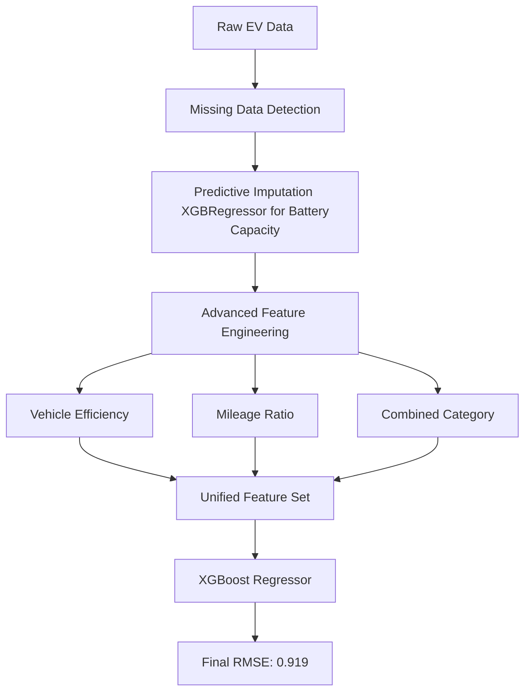

# ⚡ EV Price Forecast Hackathon: Predictive Modeling for Asset Valuation

[](https://www.python.org/downloads/)
[](https://xgboost.readthedocs.io/)
[]()

## 📌 Project Overview
As the Electric Vehicle (EV) market matures, accurate asset valuation becomes critical for consumers and manufacturers alike. This repository contains the solution for the **EV Price Forecast Hackathon** hosted by DACON.

## 🚀 Executive Summary (TL;DR)
- **The Problem**: Accurate asset valuation of Electric Vehicles (EVs) is challenging due to complex non-linear depreciation and missing critical technical specs (Battery Capacity).
- **The Solution**: Developed a high-precision **XGBoost regression model** integrating advanced feature engineering and machine learning-based imputation.
- **The Result**: Achieved an **RMSE of 0.919** (Normalized Scale) on the leaderboard, proving the effectiveness of the feature interactions and imputation strategy.

## 🛠 Tech Stack
- **Modeling**: XGBoost Regressor
- **Data Processing**: Pandas, NumPy
- **Machine Learning**: Scikit-Learn (Predictive Imputation & Evaluation)
- **Validation**: ANOVA, Pearson Correlation

---

## 🔬 1. Problem Definition
As the Electric Vehicle (EV) market matures, accurate asset valuation becomes critical for consumers, manufacturers, and financial institutions alike.
- **The Challenge**: Predicting the price of used EVs based on technical specifications and usage data.
- **The Complication**: EV pricing suffers from complex non-linear depreciation and, crucially, **missing critical technical specifications** (such as Battery Capacity) in the raw data.
- **Objective**: To build a high-precision regression model that accurately values EV assets while robustly handling missing data.

---

## 🛠️ 2. System Architecture
To handle the missing critical features and complex non-linear relationships, we developed a predictive preprocessing and modeling pipeline. This ensures that missing data is handled scientifically before modeling.



---

## 📊 3. Data & Preprocessing
The primary focus of this project was feature engineering and intelligent data imputation, as raw data alone was insufficient for high-accuracy modeling.

### 🛠️ Predictive Imputation for Missing Battery Capacity
- **Problem**: A significant portion of the `배터리용량` (Battery Capacity) data was missing.
- **Solution**: Instead of simple mean imputation, an **XGBRegressor** was trained on non-missing data to predict the missing battery capacities based on other features like manufacturer, model, and mileage.
- **Impact**: Preserved the integrity of the most critical feature in EV pricing.

### 🧠 Advanced Feature Engineering
To capture the complex relationships in vehicle pricing, several domain-specific features were engineered:
- **Vehicle Efficiency**: Calculated as `주행거리(km) / 배터리용량` to represent energy efficiency.
- **Mileage Ratio**: Annual mileage calculated by dividing total mileage by age.
- **Combined Category**: Interaction feature combining Manufacturer, Model, and Vehicle Condition to capture brand equity and depreciation simultaneously.

### 📊 Statistical Feature Selection
To ensure only informative features were used, we conducted rigorous statistical testing:
- **Categorical Features**: Used **ANOVA** to find significant relationships. Found **Manufacturer, Model, Vehicle Condition, and Drive Type** to be highly significant (p-value < 0.05).
- **Numerical Features**: Used **Pearson Correlation**. Found **Warranty, Mileage, Efficiency, and Used Status** to have strong significant correlations with the target.

---

## 🤖 4. Modeling & Evaluation
We chose **XGBoost Regressor** due to its ability to handle non-linear relationships and interactions between features effectively.
- **Strategy**: 
  - **Early Stopping**: Used to prevent overfitting by monitoring validation loss.
  - **Hyperparameter Tuning**: Balanced tree depth and learning rate to capture complex non-linear patterns.
- **Result**: Achieved an **RMSE of 0.919** (Normalized Scale) on the leaderboard.

### Primary Valuation Drivers (Feature Importance)
According to the model's gain scores, the most critical factors driving EV prices were:
1. **Battery Capacity** (Predictive value + integrity preserved via ML imputation).
2. **Max Range** (Crucial utility metric for EVs).
3. **Brand Equity** (Interaction of Manufacturer & Model).

### ⚠️ Limitations & Future Work
- **Imputation Dependency**: The final model's performance relies heavily on the accuracy of the imputed battery capacity.
- **Future Work**: Explore deep learning models for tabular data like **TabNet** and implement **SHAP** to explain the non-linear impact of battery degradation on price.

---

## 🏁 5. Conclusion & Business Impact
The project successfully demonstrated how to handle missing data scientifically in asset valuation.
- **Outcome**: Built a robust valuation model achieving high accuracy (RMSE 0.919).
- **Impact**: Proved that predictive imputation is far superior to simple statistical filling (mean/mode) for critical missing features, providing a methodology applicable to other domain-heavy datasets.

---

## 📁 Repository Structure
```text
├── data/                       # Dataset files
├── notebooks/                  # Exploratory notebooks
│   └── EV_price_prediction_xgb.ipynb
├── src/                        # Extracted Python scripts
│   └── ev_price_prediction_xgb.py
├── ev_pricing_pipeline.py      # Main pipeline script
└── README.md                   # Project documentation
```

## ⚙️ How to Run
1. Install dependencies:
   ```bash
   pip install xgboost pandas numpy scikit-learn
   ```
2. Run the pipeline:
   ```bash
   python ev_pricing_pipeline.py
   ```

## 👥 Contributors
- **Junhyung L.** (Project Lead)

---
*Refactored and polished to meet professional software engineering standards for the [Data Analyst Portfolio](https://github.com/junhyung-L).*
