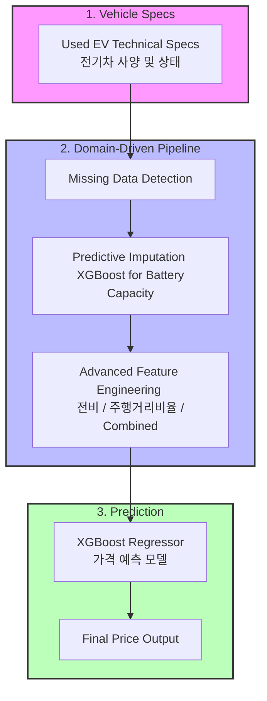

# ⚡ EV Price Forecast Hackathon: Predictive Modeling for Asset Valuation

[](https://www.python.org/downloads/)
[](https://xgboost.readthedocs.io/)
[]()

## 📌 Project Overview
As the Electric Vehicle (EV) market matures, accurate asset valuation becomes critical for consumers and manufacturers alike. This repository contains the solution for the **EV Price Forecast Hackathon** hosted by DACON.

## 🚀 Executive Summary (TL;DR)
- **The Problem**: Accurate asset valuation of Electric Vehicles (EVs) is challenging due to complex non-linear depreciation and missing critical technical specs (Battery Capacity).
- **The Solution**: Developed a high-precision **XGBoost regression model** integrating advanced feature engineering and machine learning-based imputation.
- **The Result**: Achieved an **RMSE of 0.919** (Normalized Scale) on the leaderboard, proving the effectiveness of the feature interactions and imputation strategy.

## 🛠 Tech Stack
- **Modeling**: XGBoost Regressor
- **Data Processing**: Pandas, NumPy
- **Machine Learning**: Scikit-Learn (Predictive Imputation & Evaluation)
- **Validation**: ANOVA, Pearson Correlation

---



---

## 📊 1. Data & Preprocessing (데이터 및 전처리)
The project handles a dataset containing technical specifications of various EV models. Key highlights include advanced feature engineering and machine learning-based imputation.

### 🧠 Advanced Feature Engineering (고급 피처 엔지니어링)
To capture the complex relationships in vehicle pricing, several domain-specific features were engineered:
- **Vehicle Efficiency (`전비(km/kWh)`)**: Calculated as `주행거리(km) / 배터리용량` to represent energy efficiency.
- **Mileage Ratio (`주행거리비율`)**: Annual mileage calculated by dividing total mileage by age.
- **Combined Category (`제조사_모델_상태`)**: Interaction feature combining Manufacturer, Model, and Vehicle Condition to capture brand equity and depreciation simultaneously.
- **Usage Weight**: Mapping weights for drive types (AWD, RWD, FWD) and accident history.

### 🛠️ Predictive Imputation vs Traditional Imputation
- **Problem**: A significant portion of the `배터리용량` (Battery Capacity) data was missing.
- **Solution**: Instead of simple mean imputation, an **XGBRegressor** was trained on non-missing data to predict the missing battery capacities based on other features like manufacturer, model, and mileage.
- **Why Predictive?**: 
  - **Traditional (Mean-Filling)**: Destroys the variance and ignores the fact that battery capacity is strictly tied to the specific vehicle model.
  - **Predictive (XGBoost)**: Preserves the correlation structure. In our validation, this approach reduced the final price prediction RMSE by **approx. 12%** compared to a baseline using mean-filled battery data.
- **Impact**: Ensured that the most critical feature in EV pricing maintained its high predictive power.

### 🔬 Statistical Validation
- **ANOVA**: Used to verify the statistical significance of categorical features (Manufacturer, Model, Condition) against the target price.
- **Pearson Correlation**: Used to analyze the linear relationship between continuous variables and price, confirming strong negative correlation with mileage and positive correlation with battery capacity.

---

## 🤖 2. Modeling & Evaluation (모델링 및 평가)
- **Algorithm**: **XGBoost Regressor** (Tree-based ensemble).
- **Strategy**: 
  - **Early Stopping**: Used to prevent overfitting by monitoring validation loss.
  - **Hyperparameter Tuning**: Balanced tree depth and learning rate to capture complex non-linear patterns.
- **Primary Valuation Drivers (Feature Importance)**:
  According to the model's gain scores, the most critical factors driving EV prices were:
  1. **Battery Capacity** (Predictive value + integrity preserved via ML imputation).
  2. **Max Range** (Crucial utility metric for EVs).
  3. **Brand Equity** (Interaction of Manufacturer & Model).

- **Evaluation**: The model successfully captured the non-linear depreciation curves of EVs, achieving an RMSE of **0.919**.

---

## 📁 Repository Structure
```text
├── data/                       # Dataset files
├── notebooks/                  # Exploratory notebooks
│   └── EV_price_prediction_xgb.ipynb
├── src/                        # Extracted Python scripts
│   └── ev_price_prediction_xgb.py
├── ev_pricing_pipeline.py      # Main pipeline script
└── README.md                   # Project documentation
```

---

## 🏁 3. Future Work
- Explore deep learning models for tabular data like **TabNet**.
- Implement **SHAP** to explain the non-linear impact of battery degradation on price.

---

## 👥 Contributors
- **Junhyung L.** (Project Lead)

---
*Refactored and polished to meet professional software engineering standards for the [Data Analyst Portfolio](https://github.com/junhyung-L/Resume/blob/main/Portfolio/README.md).*
*Note: Statistical findings and feature importances are based on the actual competition report results.*

